## 一、框架介绍

- 本框架主要是基于 python 语言编写，结合 pytest 进行二次开发
- 本框架支持多业务接口依赖，多进程执行，mysql 数据库断言和 接口响应断言,并且用例直接在yaml文件中维护，无需编写业务代码
- 接口pytest框架生成pytest-testreport报告，并且支持发送 企业微信通知/ 钉钉通知/ 邮箱通知/ 飞书通知，灵活配置
- 如果你会postman, 你会发现postman有的功能它都有, postman没有的功能, 它也有
- 你只需要在 yaml 文件中编写测试用例，编写成功之后，会自动生成 pytest 的代码，零基础代码小白也可以操作

## 二、实现功能

1. 测试数据隔离, 实现数据驱动
2. 一键解析swagger文档, 自动批量生成yaml测试用例
3. 测试数据随机化: 支持模板语法, 用例中可以定义变量随机生成数字, 电话, 地区, 邮箱, 姓名, 公司名等等...
4. 支持多接口数据依赖: 如A接口需要同时依赖B、C接口的响应数据作为参数
5. 数据库断言: 直接在测试用例中写入查询的sql即可断言，无需编写代码
6. 响应内容断言: 可使用jsonpath表达式, 提取接口响应内容进行断言
7. 动态多断言: 如接口需要同时校验响应数据和sql校验，支持多场景断言
8. 自动生成用例代码: 测试人员在yaml文件中填写好测试用例, 程序可以直接生成用例代码，纯小白也能使用
9. 测试报告展示历史测试结果, 表格形式和曲线图显示分别展示
10. 统计接口的运行时长: 拓展功能，订制开关可以决定是否需要使用
11. 日志输出: 记录每个接口的详细信息，包括断言方式以及预期结果, 同时订制了开关可以决定是否需要打印日志
12. 钉钉、企业微信, 飞书, 邮件通知: 支持多种通知场景
13. 多线程执行, 失败用例重跑机制, 自定义跳过用例等等

## 三、目录结构


    ├── cache                          // 存放缓存文件
    ├── conf                           // 配置文件
    │   ├── config.ini                  // 公共配置
    ├── data                           // 测试用例数据
    ├── files                           // 上传文件接口所需的文件存放区域
    ├── logs                            // 日志文件
    ├── reports                         // 测试报告html
    	├── history.json                //历史测试执行结果
    ├── test_case                      // 测试用例代码
    ├── utils                          // 工具类
    │   └── handler_assert                // 断言
    │       └── assert_control.py         // 断言逻辑处理
    │       └── assert_type.py         // 断言方法
    │   └── handler_auto_code             // 自动生成代码
    │       └── auto_code_control.py      // 自动生成代码逻辑
    │       └── case_template.py          // 代码模板
    │   └── handler_cache              // 缓存
    │       └── cache_control.py          // 本地缓存处理
    │       └── redis_control.py          // redis缓存处理
    │       └── set_api_to_cache.py       // 设置当前接口缓存 
    │       └── update_case_cache.py      // 更新缓存数据 
    │   └── handler_conf               // 配置文件
    │       └── conf_control.py           // 操作配置文件
    │       └── get_conf_data.py          
    │   └── handler_enum               // 枚举
    │       └── assert_method_enum.py     // 断言方法枚举 
    │       └── depend_data_enum.py       // 依赖数据枚举
    │       └── inform_type_enum.py       // 通知方式枚举
    │       └── request_params_enum.py    // 请求参数枚举
    │   └── handler_inform             // 通知
    │       └── ding_talk.py              // 钉钉
    │       └── email.py                  // 邮件
    │       └── fly_book.py               // 飞书
    │       └── ding_talk.py              // 钉钉
    │       └── wechat.py                 // 企业微信
    │       └── send_inform.py            // 逻辑处理
    │   └── handler_jsonpath          // jsonpath表达式提取
    │       └── jsonpath_control.py      // 提取数据逻辑处理 
    │   └── handler_log               // 日志
    │       └── log_control.py           // 日志输出
    │       └── log_decorator.py         // 装饰器 
    │   └── handler_mysql             // 数据库
    │       └── mysql_control.py         // 增删改查
    │   └── handler_path              // 目录
    │       └── path_contr.py            // 文件路径处理 
    │   └── handler_random            // 随机数
    │       └── path_contr.py             // 生成随机数据  
    │   └── handler_request           // request
    │       └── depend_control.py         // 提取依赖数据
    │       └── encryption_algorithm_control.py        // 加密
    │       └── request_control.py        // 请求前置
    │       └── teardown_control.py       // 请求后缀 
    │   └── handler_time              // 时间
    │       └── time_control.py           // 提取时间 
    │   └── handler_yaml              // yaml解析
    │       └── yaml_analysis.py           // 解析用例数据 
    │       └── yaml_control.py            // 读取用例数据  
    │   └── recording                 // 录制
    │       └── mitmproxy_control.py       // 代理录制--暂定 
    ├── Readme.md                         // help 
    ├── pytest.ini                        // pytest配置
    ├── requirements.txt                  // 依赖
    ├── run.py                            // 运行入口  

## 五、使用前言

### 5.1 安装依赖

- python环境搭建好后，则安装本框架的所有第三方库依赖，执行如下命令

```python
pip install -r requirements.txt
```

---

### 5.2 接口文档

- 框架会针对接口中的登录、充值、提现, 添加项目（新增、查看、修改、删除）等功能，编写结果自动化案例
- 因接口文档较为零散, 大家可以参考代码中的测试用例,

---

### 5.2 如何简单使用

1. 在data文件夹下方创建相关的yaml用例
2. 如果只想执行单个测试用例, 那么需要手动执行 utils/handler_auto_code/auto_code_control.py这个文件，生成自动化代码
3. 执行auto_code_control.py文件之后，会发现，在test_case层新增该条用例的对应代码，可直接执行该用例进行调试
4. 也可以直接运行 run.py文件, 自动生成测试代码, 执行所有测试用例

---

### 5.3 用例中相关字段介绍

| 字段参数        |                  |              |             | 参数描述                                                     | 是否必需 |
| --------------- | ---------------- | ------------ | ----------- | ------------------------------------------------------------ | -------- |
| case_id(用例id) |                  |              |             | 每条测试用例都需要用例id, 如:login_01                        | √        |
|                 | url              |              |             | 路径地址(在配置文件需要设置host地址,这里的url会跟它进行拼接) 如:/user/login | √        |
|                 | method           |              |             | 请求方式: get,post,pull,delete等                             | √        |
|                 | title            |              |             | 用例标题(描述) 如:普通用户登录                               | √        |
|                 | headers          |              |             | 请求头                                                       | √        |
|                 | params           |              |             | url路径参数                                                  | ×        |
|                 | data             |              |             | 表单类型参数                                                 | ×        |
|                 | json             |              |             | json格式参数                                                 | ×        |
|                 | is_run           |              |             | 是否执行用例, False会跳过不执行 如: True/False               | √        |
|                 | is_token         |              |             | 是否需要token, 默认全局配置是需要token的 如果有不需要token的接口,添加该字段为False即可 | ×        |
|                 | is_depend        |              |             | 是否需要依赖数据, 例如B接口依赖A接口的响应数据 如: True/False | √        |
|                 | depend_case_data |              |             | 依赖的用例数据 如果is_depend为True,该字段是必须的            | √        |
|                 |                  | case_id      |             | 依赖的用例id 如:login_01                                     | √        |
|                 |                  | depend_data  |             | 具体的依赖数据                                               | √        |
|                 |                  |              | depend_type | 依赖数据的类型, 如:response/request/db 如果是response, 那么就是在依赖用例的响应内容中提取数据 如果是request,那么就是在依赖用例的请求内容中提取数据 如果是db,那么就是在setup_sql中的查询内容提取数据 | √        |
|                 |                  |              | jsonpath    | jsonpath表达式, 在指定的依赖类型中提取value 如: $.data.id    | √        |
|                 |                  |              | set_cache   | 设置提取的value存入缓存中,可选字段 如: userid, 参数值是缓存名 | ×        |
|                 |                  |              | replace_key | 设置提取的value,替换当前用例的指定数据,也是jsonpath语法 如:$.params.user_id | ×        |
|                 | assert           |              |             | 断言                                                         |          |
|                 |                  | apicode      |             | 断言名--自定义, 用于区分多组断言数据                         | √        |
|                 |                  |              | assert_type | 断言的数据类型, 目前只支持数据库和响应断言 如:response/sql   | √        |
|                 |                  |              | jsonpath    | jsonpath表达式, 在指定的断言类型中提取value 如: $.data.id    | √        |
|                 |                  |              | 断言方式    | 断言方式包含:==,lt,gt,contains等 如: ==:10/gt:20/contains:'登录成功' | √        |
|                 | sql              |              |             | 提取数据库数据, 用于数据库断言                               | ×        |
|                 | setup_sql        |              |             | 前置sql,用于接口依赖数据库中的数据                           | ×        |
|                 | teardown_sql     |              |             | 后置sql,用于接口数据执行完毕的数据清洗                       | ×        |
|                 | teardown_case    |              |             | 用例后置处理                                                 | ×        |
|                 |                  | case_id      |             | 依赖的用例id 如:login_01                                     | √        |
|                 |                  | param_ready  |             | 先做参数准备,在执行后置请求                                  | ×        |
|                 |                  |              | depend_type | 依赖的类型,如:self_response 如果是self_response, 那么就是在当前依赖用例id的响应内容中提取数据 | √        |
|                 |                  |              | jsonpath    | jsonpath表达式, 在指定的依赖类型中提取value 如: $.data.id    | √        |
|                 |                  |              | set_cache   | 将当前提取的数据存入缓存                                     | √        |
|                 |                  | send_request |             | 用于直接发送后置请求                                         | ×        |
|                 |                  |              | depend_type | 依赖的类型,如:cache/response/ 如果是response,那么就是在这个接口请求的响应内容中提取数据 如果是cache,那么就是从缓存中提取数据 | √        |
|                 |                  |              | cache_name  | 缓存的字段名                                                 | ×        |
|                 |                  |              | jsonpath    | jsonpath表达式, 在指定的依赖类型中提取value 如: $.data.id    | ×        |
|                 |                  |              | replace_key | 设置提取的value,替换当前用例的指定数据,也是jsonpath语法 如:$.params.user_id | ×        |
|                 | set_api_cache    |              |             | 用于设置当前接口的请求数据/响应数据存入缓存中                | ×        |
|                 |                  | depend_type  |             | 提取的依赖的数据类型 如:response/request                     | √        |
|                 |                  | jsonpath     |             | jsonpath表达式, 在指定的类型中提取value 如: $.data.[0].id    | √        |
|                 |                  | cache_name   |             | 设置提取的value存入缓存中,可选字段 如: userid, 参数值是缓存名 | √        |
|                 | sleep            |              |             | 等待时间, 用于接口响应过慢                                   | ×        |

上方是每个字段的大致介绍, 下面会对每个字段的用法进行示例

---

## 六、具体使用方法

### 6.1 如何发送普通的get/post请求

- 上方了解了用例的数据结构之后，下面我们开始编写第一个get请求方式的接口。
- 首先，开始编写项目前，我们需要 conf/config.ini 中配置项目接口的环境

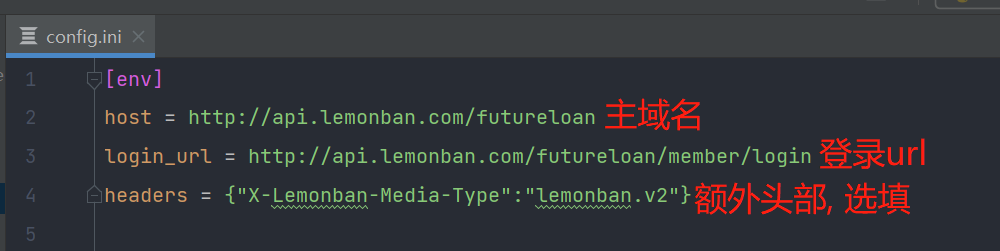

接口的环境配置好后，我们来编写测试用例，在 data 文件下面

创建一个名称为recharge.yaml 的用例文件，测试这个 **/member/recharge **充值接口

```yaml
recharge_01:
    url: /member/recharge
    method: POST
    title: 整数充值
    headers:
      # 请求头类型
      Content-Type: application/json;
    json:  # json格式这里的参数类型就填写json, 或者data,params,files,export
        member_id: 1774155
        amount: 10
    # 是否执行用例
    is_run: True
    # is_token: False  如果添加这个字段后, 该条用例就不需要token,默认是需要token
    # 是否有依赖业务，为空或者false则表示没有
    is_depend: True
    # 依赖的数据
    depend_case_data:
      - case_id: login_01
        depend_data:
          - depend_type: response
            jsonpath: $.data.id
            # 设置为缓存
            #set_cache: member_id
            # 替换请求内容中的数据
            replace_key: $.json.member_id
    # 断言
    assert:
      # 断言接口状态码
      apicode:
        assert_type: response
        jsonpath: $.code
        ==: 0
      # 断言接口返回的id
      userid:
        assert_type: response
        jsonpath: $.data.id
        ==: 17741
    #sleep: 5  添加该字段后,用例会等待5秒后执行
    sql:
```

---

### 6.2 如何测试上传文件接口

首先，我们将所需要测试的文件，全部都放在 files 文件夹中
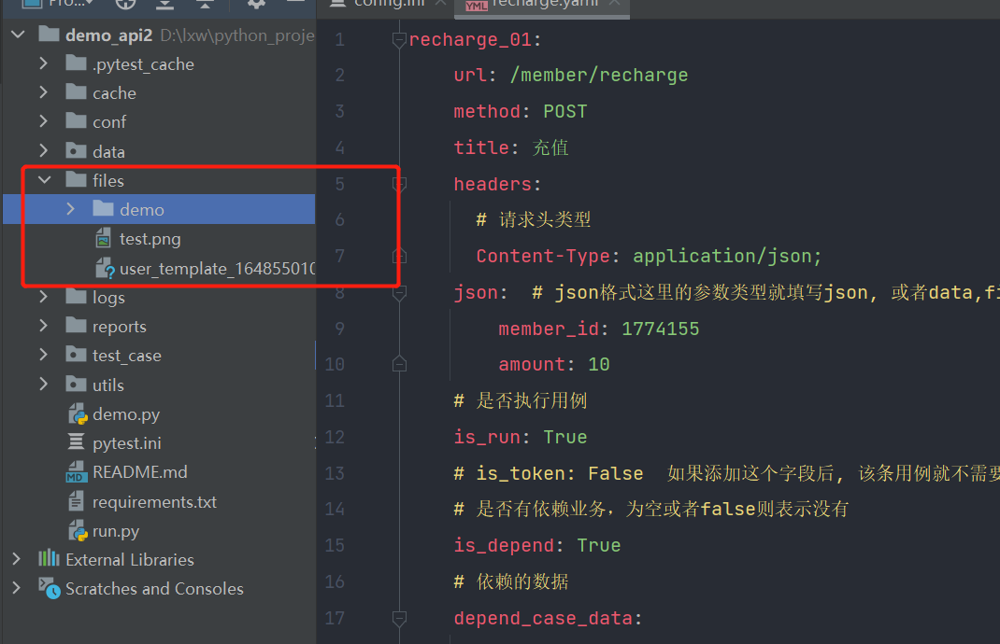

- 请求体配置

    ```yaml
    headers:
    	# 请求头类型
    	Content-Type: multipart/form-data;
    files:
    	# 文件上传参数
    	file_name: test.png 
    # 是否执行用例
    is_run: True
    ```

    file_name:  这个file_name是接口定义的上传文件的参数，test.png 这个是我们放在files这个文件夹下方的文件

    如果上传文件接口，需要上传文件，又需要上传其他参数

    ```yaml
    headers:
    	# 请求头类型
    	Content-Type: multipart/form-data;
    params:
    	xxx: value
    files:
    	# 文件上传参数
    	file_name: test.png 
    # 是否执行用例
    is_run: True
    ```

    为了方便大家理解，下面以postman的形式上传

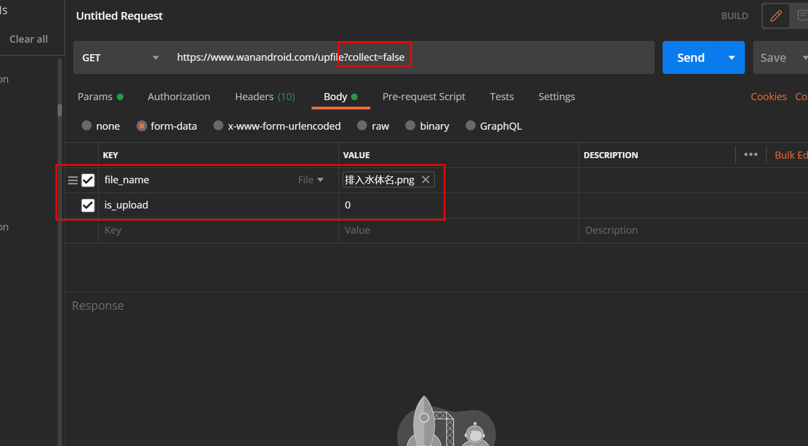

---

### 6.3 业务管理的接口逻辑，如何编写测试用例

- 我们拿个简单的例子举例，比如登录场景，在登陆之前，我们需要先获取到验证码

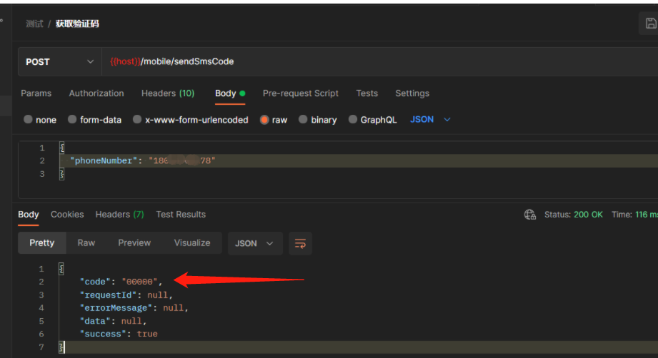

- 然后登录接口需要拿到验证码之后才可以进行登录

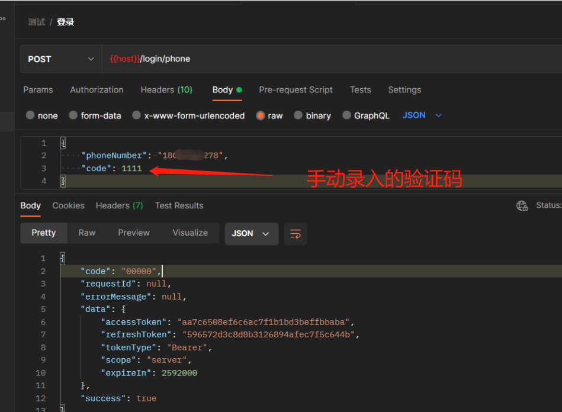

在框架中如何实现自动获取依赖接口的数据呢

首先，我们先创建一个 get_sms_code.yaml 的文件，编写一条发送验证码的用例

```yaml
sms_code_01:
    url: /mobile/sendSmsCode
    method: POST
    title: 正常获取登录验证码
    headers:
      Content-Type: application/json;charset=UTF-8
    # 请求的数据，是 params 还是 json、或者files
    json:
      phoneNumber: "180****9278"
    # 是否执行
    is_run: True
    # 是否有依赖业务，false则表示没有
    is_depend: False
    # 依赖的数据
    depend_case_data:
    # 断言
    assert:
      code:
      	# 断言自身接口的响应内容
      	aassert_type: response
        jsonpath: $.code
        ==: '00000'
      success:
      	aassert_type: response
        jsonpath: $.success
        ==: true
    sql:
```

下面开始编写一个 login.yaml 文件

```yaml
login_02:
    url: /login/phone
    method: POST
    title: 获取验证码登录
    headers:
      Content-Type: application/json;charset=UTF-8
    # 请求的数据，是 params 还是 json、或者files
    json:
      phoneNumber: 18014909278
      # 这里的code是要获取依赖接口的code值
      code:
    # 是否执行
    is_run: True
    # 是否有依赖业务，false则表示没有
    is_depend: True
    # 依赖的数据
    depend_case_data:
      # 依赖的用例id
      - case_id: sms_code_01
    	depend_data:
      	  - depend_type: response
          # 通过jsonpath语法在依赖接口的响应数据中提取code
          	jsonpath: $.code
            # 然后替换至本身请求体中的code值
            replace_key: $.json.code  
    assert:
      code:
        aassert_type: response
        jsonpath: $.code
        ==: '00000'
    sql:
```

**其中处理多业务的核心区域，主要在这块**

```yaml
# 是否有依赖业务，false则表示没有
is_depend: True
# 依赖的数据
depend_case_data:
  # 依赖的用例id
  - case_id: sms_code_01
    depend_data:
  	  # 依赖数据1
  	  - depend_type: response
        # 通过jsonpath语法在依赖接口的响应数据中提取code
        jsonpath: $.code
        # 然后替换至本身请求体中的code值
        replace_key: $.json.code 
```

首先，我们 is_depend需要设置成 True，并且在下面的 depend_case_data中设计相关依赖的数据。

* case_id：上方场景中，我们登录需要先获取验证码，因此依赖的case_id 就是发送短信验证码的 case_id ：sms_code_01
*  depend_type：我们依赖的是获取短信验证码接口中的响应内容，因此这次填写的是 response
* jsonpath: 通过jsonpath 提取方式，提取到短信验证码中的验证码内容
* replace_key：拿到验证码之后，我们将本条用例中的json中的code参数，那么我们使用jsonpath的方式，进行替换 $.json.code

---

### 6.4 处理接口中需要依赖同一个接口中的多个数据

```yaml
# 是否有依赖业务，false则表示没有
is_depend: True
# 依赖的数据
depend_case_data:
  # 依赖的用例id
  - case_id: sms_code_01
    depend_data:
  	  # 依赖数据1--提取code
  	  - depend_type: response
        # 通过jsonpath语法在依赖接口的响应数据中提取code
        jsonpath: $.code
        # 然后替换至本身请求体中的code值
        replace_key: $.json.code 
        
  	  # 依赖数据2--提取token
  	  - dependent_type: response
        jsonpath: $.data.token
        # 替换请求头中的token
        replace_key: $.headers.token    
```

**如上方示例，可以添加多个 depend_type**

---

### 6.5 处理接口中需要依赖多个接口中的不同数据

假设我们需要获取 sms_code_01、get_code_01两个接口中的数据，用例格式如下
    
```yaml
# 是否有依赖业务，false则表示没有
is_depend: True
# 依赖的数据
depend_case_data:
  # 依赖的用例id
  - case_id: sms_code_01
    depend_data:
  	  # 依赖数据1--提取code
  	  - depend_type: response
        # 通过jsonpath语法在依赖接口的响应数据中提取code
        jsonpath: $.code
        # 然后替换至本身请求体中的code值
        replace_key: $.json.code 
        
  - case_id: get_code_01
    depend_data:
  	  # 依赖数据1--提取code
  	  - depend_type: response
        # 通过jsonpath语法在依赖接口的响应数据中提取code
        jsonpath: $.code
        # 然后替换至本身请求体中的code值
        replace_key: $.json.code  
```

---

### 6.6 将jsonpath提取的依赖数据存入缓存中

- 参考6.6所写, 用到的方法是提取依赖接口数据后直接替换至本身接口的参数
- 现在还可以提供直接将jsonpath提取的数据存入至缓存中, 为后续其他接口使用该数据打下铺垫
- 这里我们需要用到**set_cache**关键字

```yaml
- case_id: get_code_01
  depend_data:
  	# 依赖数据1--提取code
  	- depend_type: response
      # 通过jsonpath语法在依赖接口的响应数据中提取code
      jsonpath: $.code
      # 将我们提取到的code存入缓存中，set_cache后方定义的值，是我们缓存的名称
      # 名称可以自定义， set_cache 和 repalce_key 的方法可以二选一，两种都支持
      set_cache: verify_code  
```

---

### 6.7 将当前用例的请求值或者响应值存入缓存中

- 程序中提供了set_api_cache这个关键字,可以将当前这条用例的请求数据 或者响应数据存入缓存中
- 如下案例所示：

```yaml
set_api_cache:
  # 1、response 从响应中提取内容  2、request从请求中提取内容
  - type: response
    jsonpath: $.data.data.[0].id
    # 自定义的缓存名称
    cache_name: query_shop_id
```

---

### 6.8 如果请求用例的参数需要从数据库中提取

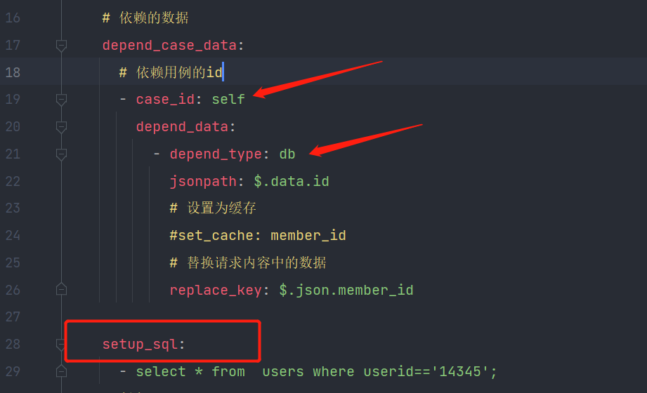

- 如上图所示，用例中的 case_id 需要换成self, 因为是从本身的前置中获取

- 注意case_id： 因为程序设计原因，通常情况下，我们关联的业务，会发送接口请求

  如果我们依赖的是db的话，是不需要发送请求的, 所以方便程序中去做区分

- depend_type 需要填写成 db, 依赖的类型为数据库, 那么下方就需要再加一个 setup_sql 的参数，下方填写需要用到的sql语句

  setup_sql字段中可以填写多条sql, 每条sql都是唯一的, 所以要注意sql语句是list类型

---

###  6.9 如果用例中需要依赖登录的token，如何处理

- 首先，为了防止重复请求调用登录接口，pytest中的 conftest.py 提供了热加载机制, 并且处理了登录所需要的代码逻辑
- 我们只需要在 conf/config.ini 配置文件中填写对应的登录参数即可

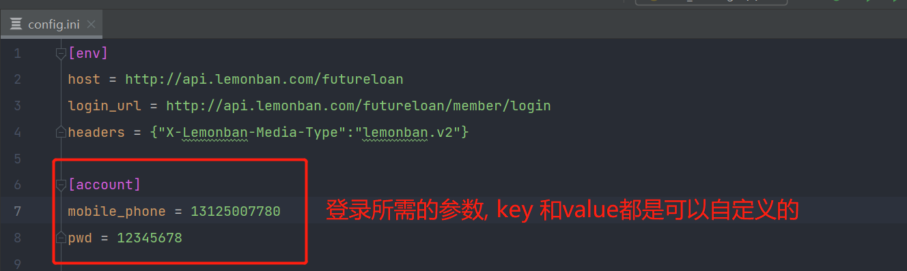

- 如上图所示，我们会先去读取配置文件中的account项，然后读取里面的参数, 登录后会将token存入至配置文件中
- 下方图展示的就是token项的配置
  - 注意extra_authorization_params字段, 是针对需要和token配合使用的
  - 如果Bearer和token中需要空格,  那么Bearer需要用引号引出空格
  - 如果不需要额外的参数,  那么这个字段值为空即可

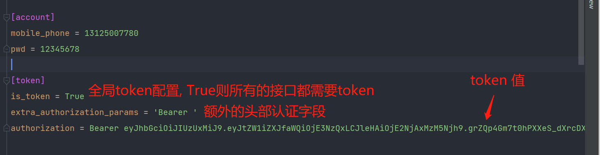

---

### 6.10 如果某些用例不需要token, 如何处理

- 程序提供了**is_token**这个关键值,  值为False则接口不需要token

```yaml
login_01:
    url: /login/phone
    method: POST
    title: 用户登录
    headers:
      Content-Type: application/json;charset=UTF-8
    # 请求的数据，是 params 还是 json、或者files
    json:
      phoneNumber: 18014909278
      # 这里的code是要获取依赖接口的code值
      code: 5555
    is_run: True
    # 用例中添加这个字段, 则该接口不需要token
    is_token: False
    is_depend: Fasle
```

---

### 6.11 用例依赖cookie如何提取

- conftest.py里面会将登录的token提取到配置文件中, 同时还会将cookie存入缓存
- 如果用例的请求头中依赖cookie中的值，直接在用例中填写模板语法**{{cache(cookie)}}

```yaml
headers:
	Content-Type: multipart/form-data;
	# 这里cookie的值，是从缓存中提取,所以写的是存入缓存的名称
	cookie: {{cache('cookie')}}
```

---

### 6.12 用例中如何生成随机数据

- 有些特殊的场景, 比如创建用户, 用户名或者手机号是不能重复的, 每次执行需要按照指定规则随机生成
- 我们可以使用模板语法 {{ random_fake('生成规则')}}, 程序读取用例时会自动解析模块语法产生的随机值

```yaml
# 注意: 这里的变量都是str类型所以需要加引号

{{ random_fake('name')}}  # 生成随机姓名
{{ random_fake('phone')}}  # 生成随机手机号
{{ random_fake('card')}}  # 生成随机身份证
{{ random_fake('email')}}  # 生成随机邮箱
{{ random_fake('date')}}  # 生成随机日期
{{ random_fake('address')}}  # 生成随机地址
{{ random_fake('company')}}  # 生成随机公司名
{{ random_fake('city')}}  # 生成随机城市
{{ random_fake('text')}}  # 生成随机一段文本
{{ random_fake('letter')}}  # 生成随机单个字母
{{ random_fake('str')}}  # 生成随机一段字符串
```

```yaml
# 如果需要随机数字, 程序也封装了对应的模范语法
{{ random_int()}}  # 生成随机4位数

# 指定范围内的随机数
{{ random_int(1,99999)}}  
```

封装了一些常用的随机数据，方便大家使用。 其他所需随机生成的数据，可自行在handle_random代码中自行添加。

---

### 6.13 如何获取缓存中的数据

- 这里同样使用模范语法获取 **{{cache(缓存名)}}**

```yaml
# 注意这里的参数同样是字符串形式

cookie: {{cache('cookie')}}
```

---
### 6.14 sql语句中依赖响应数据如何解决

- 这里同样使用模范语法获取 **{{expr(jsonpath表达式)}}**

```yaml
# 注意这里的参数同样是字符串形式

select * from stu where id={{expr('$.data.id')}}
```


### 6.15 用例中添加等待时间

- 程序中可以设定接口请求之后的等待时长，假设A接口依赖B接口的业务，A接口请求完时，我们需要让他等待几秒钟
  再次请求B接口，这样的话，我们可以使用sleep关键字

```yaml
sleep: 3
```
---

### 6.16 断言http的响应状态码

- 做接口测试的过程中，有部分接口是没有任何响应的，那么这种情况我们只能通过 http的状态码去判断这条用例是否通过
- 如下方所示:  我们直接在assert下方添加一个 status_code 参数，状态码我们判断其为 200

```yaml
assert:
  status_code: 200
```

---

### 6.17 断言类型

- 下放截图中，是所有断言支持的类型

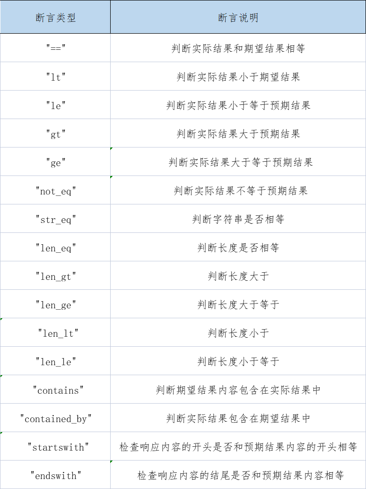

---

### 6.18 用例中如何进行接口响应断言和数据库断言

- 假设下方是我们拿到接口响应的数据内容：

    {"code": 200, "times": 155.91, "counts": 9}

- 这个时候，我们需要判断该接口返回的数据是否正确，就需要编写sql，对响应内容进行校验。

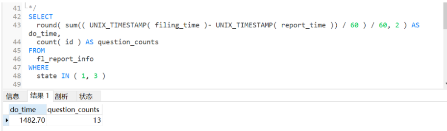

- 因此我们编写了如上sql查出对应的数据，那么用例中编写规则如下，下方我们分别断言了两个内容，一个是对接口的响应code码进行断言，一个是断言数据库中的数据。


```yaml
  assert:
  	# 断言接口响应
    code:
      assert_type: response
      jsonpath: $.code
      ==: 200
   do_time:
   	  # 断言sql的
   	  assert_type: sql
      # jsonpath 拿到接口响应的数据
      jsonpath: $.times
      # sql 查出来的数据，是字典类型的，因此这里是从字段中提取查看出来的字段
      ==: $.do_time
  sql:
    - SELECT round( sum(( UNIX_TIMESTAMP( filing_time )- UNIX_TIMESTAMP( report_time )) / 60 ) / 60, 2 ) AS do_time, count( id ) AS question_counts FROM fl_report_info WHERE state IN ( 1, 3 )
```

```yaml
# 我们的sql也是列表类型的。
# 这样就意味这，我们的sql可以同时编写多条，可以进行单表查询，获取我们需要的数据。
sql:
  - select * from users;
  - select * from goods;
```

---

### 6.19 使用teardown功能，做数据清洗

- 通常情况下，我们做自动化测试的脏数据，在测试完成之后，会需要对这些数据进行删除，程序中支持两种写法
  - 一种是直接调用接口进行数据删除。  **建议使用第一种**, 调用业务接口删除对应的数据
  - 另外一种是直接删除数据库中的数据
- 下面我们先来看看第一种删除方式，teardown的功能，因为需要兼容较多的场景，因此使用功能上相对也会比较复杂

* 假设现在我们有一个新增接口，写完之后要进行删除数据, 那么此时会设计到两个场景:

  - 第一个直接获取新增接口响应数据的id, 然后调用删除接口,  发送请求

  - 第二个是需要先查询新增的数据id, 提取到id之后再执行删除

  - 那么针对这俩个场景，我们就需要有个关键字去做区分，什么场景下先发送请求，什么场景下后发送请求

    

下面我们来看一下案例，方便大家理解

第一种场景:

```yaml
teardown_case:
  - case_id: process_apply_01
    # 这里的字段为send_request
    send_request:
      # 这里我们从当前响应中获取
      - depend_type: response
        # 通过jsonpath的方式，获取响应的内容
        jsonpath: $.data.id
        # 使用repalce_key进行替换
        replace_key: $.data.applyId  
```

第二种场景:

```yaml
teardown_case:
  # 查看品牌审核列表，获取品牌的apply_id
  - case_id: query_apply_id_01
    # 注意这里我们是先发送请求，在拿到自己响应的内容，因此我们这个字段需要写param_ready
    param_ready:
        # 因为是获取自己的响应内容，我们depend_type需要写成 self_response
      - depend_type: self_response
        # 通过jsonpath的方法，获取query_apply_id_01这个接口的响应内容
        jsonpath: $.data.data.[0].applyId
        # 将内容存入缓存，这个是自定义的缓存名称
        set_cache: applyId
        
        # 支持同时存多个数据，只会发送一次请求
      - depend_type: self_response
        jsonpath: $.data.data.[0].brandName
        set_cache: _brandName
    
  # 删除
  - case_id: delete_01
    # 删除的话，我们是直接发送请求的，因此我们这里写 send_request
    send_request:
        # 我们上方已经拿到了ID，并且将ID存入缓存中，因此这里依赖数据的类型为cache，直接从缓存中提取
      - depend_type: cache
        # 这个是缓存名称
        cache_data: applyId
        # 通过relace_key 去替换 delete_01 中的 applyID参数
        replace_key: $.data.applyId
```

程序中也支持从请求内容里面获取数据，编写规则如下

```yaml
- case_id: process_apply_01
  # 同样这么写 send_request
  send_request:
      # 这里我们从请求内容中获取
    - depend_type: request
      # 通过jsonpath的方式，获取请求的内容
      jsonpath: $.data.id
      # 使用repalce_key进行替换
      replace_key: $.data.applyId
```
---

### 6.19 自动生成test_case用例代码

- 我们编写好 yaml 用例之后，可以直接执行utils/handler_auto_code/auto_code_control.py 
- 程序会根据你设计的测试用例，生成对应的代码。
- 也可以直接运行 run.py文件, 自动生成所有的测试代码, 并执行所有测试用例

---

## 七、发送自动化测试结果通知

### 7.1 发送钉钉通知通知

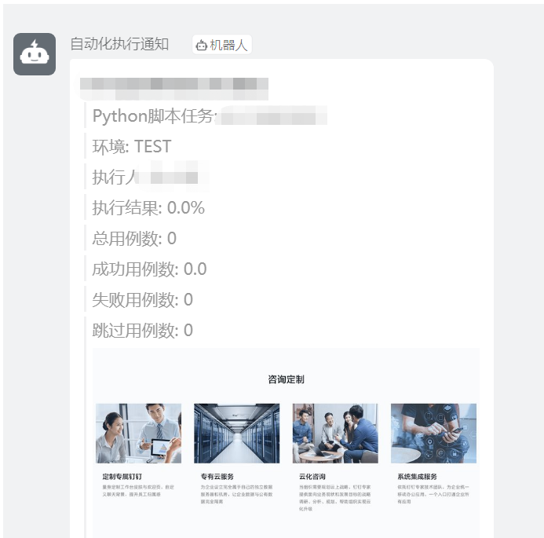

### 7.2 发送企业微信通知

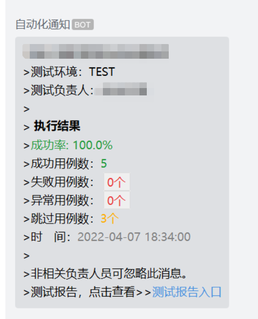


---

## 八、生成测试报告

- 我们直接运行主程序 run.py ，运行完成之后，就可以生成非常漂亮的测试报告

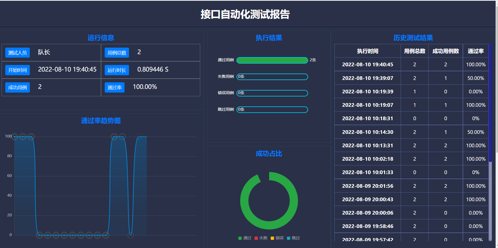

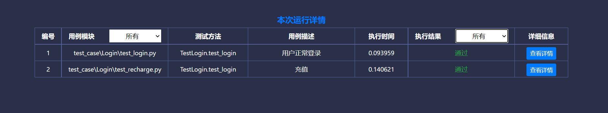

---

## 九、结束语

如果这个库有帮助到你并且你很想支持库的后续开发和维护，那么你可以扫描下方二维码联系我, 谢谢大家


---

